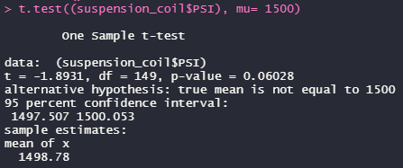

# MechaCar Statistical Analysis
## Overview
We have been hired by Jeremy and his data analytics team to produce an in-depth statistical review of AutosRUs’ newest prototype, the MechaCar. The car is suffering from production troubles, which in return, is hindering the manufacturing team’s ability to progress with the R&D of the prototype. We will be investigating the production data provided to us by upper management to review, analyze, and provide our findings to the manufacturing team that can help them in the development process.

## Tools Used:
- R

## Dataset:
- 50 MechaCar Prototypes: MechaCar_mpg.csv
- Production Lot Results: Suspension_Coil.csv

## Objectives:
- Perform multiple linear regression analysis to identify which variables in the dataset predict the mpg of MechaCar prototypes
- Collect summary statistics on the pounds per square inch (PSI) of the suspension coils from the manufacturing lots
- Run t-tests to determine if the manufacturing lots are statistically different from the mean population
- Design a statistical study to compare vehicle performance of the MechaCar vehicles against vehicles from other manufacturers. For each statistical analysis, you’ll write a summary interpretation of the findings.

## Linear Regression to Predict MPG

**- Which variables/coefficients provided a non-random amount of variance to the mpg values in the dataset?**

In the summary output provided above, each p-value represents the probability that each coefficient contributes to a random amount of variance in the multiple linear regression model. The variables that provide a non-random amount of variance to the MPG values in the dataset are vehicle length and ground clearance. According to results, vehicle length and ground clearance had p-values of 2.60 x 10^-12 and 5.21 x 10^-8 respectively. 

**- Is the slope of the linear model considered to be zero? Why or why not?**

The slope of the linear model cannot be considered to have a value of zero. The p-value of the linear regression analysis is 5.35 x 10^-11, which is by far smaller than the assumed significance level of 0.05%. Therefore, we can consider that there is sufficient evidence to reject the null hypothesis. Meaning that the slop of the linear model is not zero. 

**- Does this linear model predict mpg of MechaCar prototypes effectively? Why or why not?**

While the model has shown that there is still unconsidered factors that are affecting the results, given that the r-squared produced, it does prove the argument that the linear model predicts MPG of MechaCar prototypes effectively. Essentially, what determines its effectiveness is the r-squared value. The r-squared value of 0.7149, therefore, model is approximately 71% accurate and sufficiently and predicts the dependent variable using the multiple linear regression model. 

## Summary Statistics on Suspension Coils
**- The design specifications for the MechaCar suspension coils dictate that the variance of the suspension coils must not exceed 100 pounds per square inch. Does the current manufacturing data meet this design specification for all manufacturing lots in total and each lot individually? Why or why not?**

The table above demonstrates the total summary of all of the manufacturing lots’ mean, median, variance, and standard deviation. Viewing the variance, which is 62.29356 pounds PSI, this proves that the current manufacturing data does meet the design specification in total as it does not exceed 100 pounds PSI. 

As we use the summarize function again but break down each lots mean, median, variance, and standard deviation, they each paint a different picture individually. Both Lot1 and Lot2 meet the design specification as they both have a variance of the suspension coils to be far from exceeding 100 pounds PSI. However, Lot3 tells a difference story, in which its variance of the suspension coils does exceed the 100 pounds PSI limit. Lot3 contains a variance of 170.2861224, causing Lot3 no to meet the design specifications of the car prototype. 

## T-Tests on Suspension Coils
**Briefly summarize your interpretation and findings for the t-test results. Include screenshots of the t-test to support your summary.**

In the above snapshot of the t-test for all of the suspension coils across all manufacturing lots, we are able to see that as a whole, the three lots aggregated display that they are not statistically different from the population mean. The p-value, being 0.06028, determines this conclusion for us as it is not low enough for us to sufficiently reject the null hypothesis. 

As we view the t-test performed for Lot1, we can see that the suspension coils are not statistically different from the population mean. Additionally, as the p-value is 1, we can conclude to accept the null hypothesis.

Reviewing the t-test performed for Lot2, we can arrive at the same conclusion as Lot1, that the suspension coils are not statistically different from the population mean. As the p-value is 0.6072, we can sufficiently say that there is not enough for us to reject the null hypothesis. 

For the t-test performed on Lot3, we can conclude that the suspension coils are statistically different from the population mean. With the p-value given to be 0.04168, we can state that there is enough evidence to reject the null hypothesis. Just as we have already reviewed its variance, we need to further review Lot3 closer to see what underlying factors is affecting this manufacturing lot and if it is sufficient enough to allow it to be kept in our statistical testing of the MechaCar prototype analysis. 

## Study Design: MechaCar vs. Competition
**Write a short description of a statistical study that can quantify how the MechaCar performs against the competition. In your study design, think critically about what metrics would be of interest to a consumer: for a few examples, cost, city or highway fuel efficiency, horse power, maintenance cost, or safety rating.
In your description, address the following questions:**

- **What metric or metrics are you going to test?**
If a statistical study were performed in order to quantify how the MechaCar performs against the competition, the following four metrics would be the primary focus of the analysis:

- Vehicle price
- Maintenance cost
- Vehicle safety rating
- Highway Fuel Efficiency

These four are chosen as they are seen as primary factors that are of large interest to any consumer when taking the step of purchasing a vehicle. Price is by far a huge metric as consumers will look to have a limit or budget for vehicle purchase, all which are influenced by maintenance cost, vehicle safety rating, and highway fuel efficiency. 

- ** What is the null hypothesis or alternative hypothesis?**

**Null Hypothesis (Ho):** The average price of Mechacar demonstrates no statistical difference with the average price of the competition to affects its performance.  

**Alternative Hypothesis (Ha):** The average price of Mechacar demonstrates slightly above or below statistical difference with the average price of the competition to affects its performance.  

- **What data is needed to run the statistical test?**